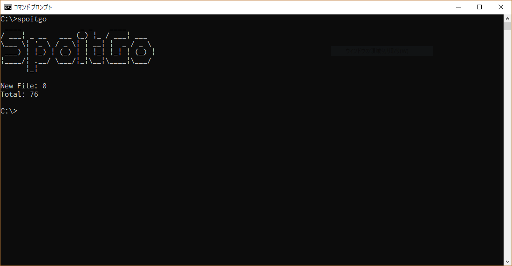

# SpoitGo

Windows Spotlight画像を収集するアプリです。Windows Spotlightの画像はローカルに保存されているので、その画像をピクチャ配下にコピーするだけのツールです。定期的にアプリを起動することで画像を保存することができます。


## Install

```
go get -u github.com/ysbrothersk/spoitgo
```

## Usage
`spoitgo`コマンドを実行するだけです
> Pictures/SpoitGoディレクトリに画像が保存されます

```
spoitgo
```